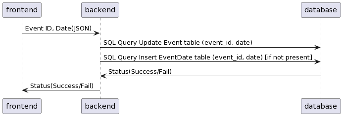

# Collap Backend

## Introduction

  The idea for this application comes from our own personal experiences planning events. Specifically when involved with a large number of participants, there are a lot of moving parts when it comes to dealing with everybody’s availability, cooperation, and overall changes with the details of the event. Because of this inevitably troubling task, we’ve thought of this project as a way to streamline event planning, automate tedious information gathering, and assist with straightening out tricky details that may arise during planning.

## Scope
Features for our application that we plan to implement are as followed:
* User Authorization
  - Login with username and password
  - Create new user with valid credentials
* Event Handling
  - View an event(s)
  - Create/Host event
  - Leave event
  - Cancel event
  - Vote on event
* Push Objectives
  - Pushing voting objectives on participants of an event
  - Anonymous Voting
* Conflict System
  - Suggest possible dates based on voting
  - Suggest dates that can work for the most people if full participation isn’t possible
* Database
  - SQL

## API Documentation
### Login
* Endpoint Name: Login
* Description: Authorizing User
* Endpoint Type: GET
* Endpoint: \login
* Parameters: Username (String), Password(String)
* Return Type: JSON
* Example Case:
  - Request:
```
{
  "username": "username",
  "password": "password"
}
```
  - Response:
```
{
  "status": "success"
}
```
or 
```
{
  "status": "failure"
}
```
* Error Handling:
  - 400: Missing Body Parameters, Username not found

* Sequence Diagram: 


### Registration
* Endpoint Name: Registration
* Description: Creating a new user profile
* Endpoint Type: POST
* Endpoint: /register
* Parameters: Username (String), Password(String)
* Return Type: JSON
* Example Case:
  - Request:
```
{
  "username": "username",
  "password": "password"
}
```
  - Response:
```
{
  "status": "success"
}
```
or 
```
{
  "status": "failure"
}
```
* Error Handling:
  - 400: Missing Body Parameters, Account already registered, Username already in use

* Sequence Diagram: 


### Events
* Endpoint Name: View Events
* Description: Retrieves a list of the user's participating events
* Endpoint Type: GET
* Endpoint: event/view
* Parameters: Username (String)
* Return Type: JSON
* Example Case:
  - Request:
```
{
  "username": "username"
}
```
  - Responses:
```
[
  {
    "eventid": 1,
    "name": "skiing",
    "host": "stephen",
    "primary": "4/12/23",
    "dates": ["4/12/23", "4/14/23"],
    "participants": [
      "joseph",
      "brandon"
    ]
  },
  {
    "eventid": 2,
    "name": "movies",
    "host": "stephen",
    "primary": "4/12/23",
    "dates": ["4/01/23", "4/08/23"],
    "participants": [
      "joseph",
      "brandon"
    ]
  }
]
```
Error Handling:
  - 400: Missing Body Parameters, Username not found


### Notifications
* Endpoint Name: Notifications
* Description: Retrieves a list of the user's notifications
* Endpoint Type: GET
* Endpoint: /notification
* Parameters: Username (String)
* Return Type: JSON
* Example Case:
  - Request:
```
{
  "username": "username"
}
```
  - Responses:
```
{
   "Vote on Date",
   "Invited to Camping :)"
}
```
* Error Handling:
  - 400: Missing Body Parameters, Username not found
 
### Create Event
* Endpoint Name: Create Event
* Description: Creates and hosts an event, sends invites to participants' notifications
* Endpoint Type: POST
* Endpoint: event\create
* Parameters: Event (JSON)
* Return Type: JSON
* Example Case:
  - Request:
```
{
   "eventid": 1,
   "name": "skiing",
   "host": "stephen",
   "primary": "4/12/23",
   "dates": [
    "4/12/23",
    "4/14/23",
   ],
   "participants": [
    "joseph",
    "brandon",
   ]
}
```
  - Response:

```
{
  "status": "success"
}
```
or 
```
{
  "status": "failure"
}
```

* Error Handling:
  - 400: Missing Body Parameters, Username not found, Participant Username not found

* Sequence Diagram


### Hosted Events
* Endpoint Name: Hosted Events
* Description: Displays the events the user is currently hosting
* Endpoint Type: GET
* Endpoint: /hosted
* Parameters: username (String)
* Return Type: JSON
* Example Case:
  - Request:
```
{
  "username": "username",
}
```
  - Response(s):
```
[
  {
    "eventid": 1,
    "name": "skiing",
    "host": "stephen",
    "primary": "4/12/23",
    "dates": ["4/12/23", "4/14/23"],
    "participants": [
      "joseph",
      "brandon"
    ]
  },
  {
    "eventid": 2,
    "name": "movies",
    "host": "jason",
    "primary": "4/01/23",
    "dates": ["4/01/23", "4/08/23"],
    "participants": [
      "joseph",
      "brandon"
    ]
  }
]
```
* Error Handling:
  - 400: Missing Body Parameters, Username not found

### Push Voting
* Endpoint Name: Push Votes
* Description: Hosted User can PUSH date voting onto participating users
* Endpoint Type: POST
* Endpoint: \push
* Parameters: Event ID (Integer), Dates (String)
* Return Type: JSON
* Example Case:
  - Request:
```
{
  "event_id": 123,
  "dates":[
    "4/23/23",
    "4/25/23",
    "3/25/23
  ]
}
```
  - Response(s):
```
{
  "status": "success"
}
```
or 
```
{
  "status": "failure"
}
```
* Error Handling:
  - 400: Missing Body Parameters, Username not found

* Sequence Diagram: 


### Vote
* Endpoint Name: Vote
* Description: Participants of an event can vote on preferred date
* Endpoint Type: POST
* Endpoint: \vote
* Parameters: Username (String), Event ID (Integer), Votes (String)
* Return Type: JSON
* Example Case:
  - Request:
```
{
  "username": "username",
  "event_id": 123,
  "date": "4/01/23"
}
```
  - Response(s):
```
{
  "status": "success"
}
```
or 
```
{
  "status": "failure"
}
```
* Error Handling:
  - 400: Missing Body Parameters, Username not found
  
* Sequence Diagram: 


### Join
* Endpoint Name: Join
* Description: User can join event, updates eventDate table, removes from notifications
* Endpoint Type: POST
* Endpoint: event\join
* Parameters: Username (String), Event ID (Integer), Dates (String)
* Return Type: JSON
* Example Case:
  - Request:
```
{
  "username": "username",
  "event_id": 123,
  "dates":[
    "4/23/23",
    "4/25/23",
    "3/25/23
  ]
}
```
  - Response(s):
```
{
  "status": "success"
}
```
or 
```
{
  "status": "failure"
}
```
* Error Handling:
  - 400: Missing Body Parameters, Username not found, Event ID not found, Cannot join/leave


* Sequence Diagram


### Reject
* Endpoint Name: Reject
* Description: User can reject an event invite, removes from notifications
* Endpoint Type: POST
* Endpoint: event\reject
* Parameters: Username (String), Event ID (Integer)
* Return Type: JSON
* Example Case:
  - Request:
```
{
  "username": "username",
  "event_id": 123
}
```
  - Response(s):
```
{
  "status": "success"
}
```
or 
```
{
  "status": "failure"
}
```
* Error Handling:
  - 400: Missing Body Parameters, Username not found, Event ID not found, Cannot join/leave

* Sequence Diagram


### Leave
* Endpoint Name: Leave
* Description: Removes user from an event and removes any votes from that user, can be invoked by leaving user or host
* Endpoint Type: POST
* Endpoint: event\leave
* Parameters: Username (String), Event ID (Integer)
* Return Type: JSON
* Example Case:
  - Request:
```
{
  "username": "username",
  "event_id": 123,
}
```
  - Response(s):
```
{
  "status": "success"
}
```
or 
```
{
  "status": "failure"
}
```
* Error Handling:
  - 400: Missing Body Parameters, Username not found, Event ID not found, Cannot leave
  
* Sequence Diagram

 

### Delete
* Endpoint Name: Delete
* Description: Checks if user is host, then deletes event
* Endpoint Type: POST
* Endpoint: event\delete
* Parameters: Username (String), Event ID (Int)
* Return Type: JSON
* Example Case:
  - Request:
```
{
  "username": "username",
  "event_id": 123
}
```
  - Response(s):
```
{
  "status": "success"
}
```
or 
```
{
  "status": "failure"
}
```
* Error Handling:
  - 400: Missing Body Parameters, Username not found, Event ID not found

* Sequence Diagram


### Rank Dates
* Endpoint Name: Rank
* Description: Ranks dates by availabilities and includes who will be excluded from each date
* Endpoint Type: GET
* Endpoint: \rank
* Parameters: Event ID (Int)
* Return Type: JSON
* Example Case:
  - Request:
```
{
  "event_id": 123
}
```
  - Response(s):
```
{
  "3/12/23":[
  ],
  "3/10/23": [
    "joseph"
  ],
  "3/09/23": [
    "joseph",
    "brandon"
  ]
}
```
* Error Handling:
  - 400: Missing Body Parameters, Event ID not found

* Sequence Diagram


### Get Votes
* Endpoint Name: Get Votes
* Description: Shows all the dates listed for voting and their vote counts
* Endpoint Type: GET
* Endpoint: \get_votes
* Parameters: Event ID (Int)
* Return Type: JSON
* Example Case:
  - Request:
```
{
  "event_id": 123
}
```
  - Response(s):
```
{
  "3/12/23": 5,
  "3/10/23": 2,
  "3/09/23": 1
}
```
* Error Handling:
  - 400: Missing Body Parameters, Event ID not found, Votes not found

  * Sequence Diagram


### Set Primary

* Endpoint Name: Set Primary
* Description: Sets the primary date
* Endpoint Type: POST
* Endpoint: \primary
* Parameters: Event ID (Int), Date (String)
* Return Type: JSON
* Example Case:
  - Request:
```
{
  "event_id": 123,
  "date": "4/13/23"
}
```
  - Response(s):
```
{
  "status": "success"
}
```
or 
```
{
  "status": "failure"
}
```
  * Sequence Diagram
