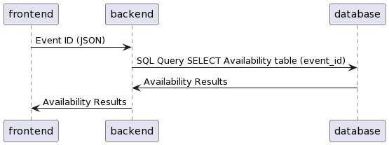

# Collap Backend

## Introduction

  The idea for this application comes from our own personal experiences planning events. Specifically when involved with a large number of participants, there are a lot of moving parts when it comes to dealing with everybody’s availability, cooperation, and overall changes with the details of the event. Because of this inevitably troubling task, we’ve thought of this project as a way to streamline event planning, automate tedious information gathering, and assist with straightening out tricky details that may arise during planning.

## Scope
Features for our application that we plan to implement are as followed:
* User Authorization
  - Login with username and password
  - Create new user with valid credentials
* Event Handling
  - View an event(s)
  - Create/Host event
  - Leave event
  - Cancel event
  - Vote on event
* Push Objectives
  - Pushing voting objectives on dates of an event
  - Anonymous Voting
* Conflict System
  - Suggest possible dates based on voting
  - Suggest dates that can work for the most people if full participation isn’t possible
* Database
  - SQLite

## API Documentation
### Login
* Endpoint Name: Login
* Description: Authorizing User
* Endpoint Type: GET
* Endpoint: \login
* Parameters: Username (String), Password(String)
* Return Type: JSON
* Example Case:
  - Request:
```
{
  "username": "username",
  "password": "password"
}
```
  - Response:
```
{
  "status": "success"
}
```
or 
```
{
  "status": "failure"
}
```
* Error Handling:
  - 400: Missing Body Parameters, Username not found

* Sequence Diagram: 


### Registration
* Endpoint Name: Registration
* Description: Creating a new user profile
* Endpoint Type: POST
* Endpoint: /register
* Parameters: Username (String), Password(String)
* Return Type: JSON
* Example Case:
  - Request:
```
{
  "username": "username",
  "password": "password"
}
```
  - Response:
```
{
  "status": "success"
}
```
or 
```
{
  "status": "failure"
}
```
* Error Handling:
  - 400: Missing Body Parameters, Account already registered, Username already in use

* Sequence Diagram: 


### Events
* Endpoint Name: View Events
* Description: Retrieves a list of the user's participating events and all info
* Endpoint Type: GET
* Endpoint: event/view
* Parameters: Username (String)
* Return Type: JSON
* Example Case:
  - Request:
```
{
  "username": "username"
}
```
  - Responses:
```
[
  {
    "eventid": 1,
    "name": "skiing",
    "host": "stephen",
    "primary": "4/12/23",
    "primary_end": "4/13/23",
    "start": 18:02:12,
    "end": 18:03:12,
    "dates": ["4/12/23", "4/14/23"],
    "participants": [
      "joseph",
      "brandon"
    ]
  },
  {
    "eventid": 2,
    "name": "movies",
    "host": "stephen",
    "primary": "2023-04-12",
    "dates": ["2023-04-01", "2023-08-01"],
    "participants": [
      "joseph",
      "brandon"
    ]
  }
]
```
Error Handling:
  - 400: Missing Body Parameters


### Notifications View
* Endpoint Name: Notifications View
* Description: Retrieves a list of the user's notifications
* Endpoint Type: GET
* Endpoint: /notification
* Parameters: Username (String)
* Return Type: JSON
* Example Case:
  - Request:
```
{
  "username": "username"
}
```
  - Responses:
```
{
  [
   "Vote on Date",
   "Invited to Camping :)"
  ]
}
```
* Error Handling:
  - 400: Missing Body Parameters, Username not found
 
### Create Event
* Endpoint Name: Create Event
* Description: Creates and hosts an event, sends invites to participants' notifications
* Endpoint Type: POST
* Endpoint: event\create
* Parameters: Event (JSON), User(String[]), Date(String[])
* Return Type: JSON
* Example Case:
  - Request:
```
{
    "event": {
        "name": "testvaliddatesecondtry",
        "host": "shinste",
        "start": "18:03:01",
        "end": "20:03:01",
        "primary": "2023-03-23",
        "primary_end": "2023-10-23",
    },
    "user": [
        "kendrick",
        "joseph"
        ],
    "date": [
        "2023-08-23",
        "2023-11-23",
        "2023-03-23"
    ]
}
```
  - Response:

```
{
  "status": "success"
}
```
or 
```
{
  "error": "That event name is currently being used by you, please try another name!"
}
```

* Error Handling:
  - 400: Missing Body Parameters, Event Name already being used, Username not found, Participant Username not found, Date Input Error

* Sequence Diagram


### Hosted Events
* Endpoint Name: Hosted Events
* Description: Displays the events the user is currently hosting
* Endpoint Type: GET
* Endpoint: /hosted
* Parameters: Username (String)
* Return Type: JSON
* Example Case:
  - Request:
```
{
  "username": "username",
}
```
  - Response(s):
```
{
  {
    "eventid": 1,
    "name": "skiing",
    "host": "stephen",
    "primary": "2023-04-12",
    "dates": ["2023-04-12", "2023-04-14"],
    "participants": [
      "joseph",
      "brandon"
    ]
  },
  {
    "eventid": 2,
    "name": "movies",
    "host": "jason",
    "primary": "2023-04-01",
    "dates": ["2023-04-01", "2023-04-08"],
    "participants": [
      "joseph",
      "brandon"
    ]
  }
}
```
* Error Handling:
  - 400: Missing Body Parameters

### Push Voting
* Endpoint Name: Push Votes
* Description: Hosted User can PUSH date voting onto participating users, sets the event open to voting, deletes previous votes if they exist, pushes voting notifications that are non-dismissable to participants
* Endpoint Type: POST
* Endpoint: \push
* Parameters: Event ID (Integer)
* Return Type: JSON
* Example Case:
  - Request:
```
{
  "event_id": 123,
}
```
  - Response(s):
```
{
  "status": "success"
}
```
or 
```
{
  "error": "Missing Input"
}
```
* Error Handling:
  - 400: Missing Body Parameters

* Sequence Diagram: 


### Vote
* Endpoint Name: Vote
* Description: Participants of an event can vote on preferred date
* Endpoint Type: POST
* Endpoint: \vote
* Parameters: Username (String), Event ID (Integer), Dates (String[])
* Return Type: JSON
* Example Case:
  - Request:
```
{
  "username": "username",
  "event_id": 123,
  "date": [
    "2023-14-12",
    "2023-15-12"
  ]
}
```
  - Response(s):
```
{
  "status": "success"
}
```
or 
```
{
  "error": "Sorry, either you were kicked from this event or you were never apart of it!"
}
```
* Error Handling:
  - 400: Missing Body Parameters, Event doesn't exist anymore, Notification doesn't exist anymore, No longer in Event
  
* Sequence Diagram: 


### Join
* Endpoint Name: Join
* Description: User can join event, updates eventDate table, inserts into availability table, removes from notifications table, sends notifications to other participants of event.
* Endpoint Type: POST
* Endpoint: event\join
* Parameters: Username (String), Event ID (Integer), Dates (String)
* Return Type: JSON
* Example Case:
  - Request:
```
{
  "username": "username",
  "event_id": 123,
  "dates":[
    "2023-04-05",
    "2023-04-10",
    "2023-04-15"
  ]
}
```
  - Response(s):
```
{
  "status": "success"
}
```
or 
```
{
  "status": "failure"
}
```
* Error Handling:
  - 400: Missing Body Parameters, Event ID not found


* Sequence Diagram


### Reject
* Endpoint Name: Reject
* Description: User can reject an event invite, removes from notifications
* Endpoint Type: POST
* Endpoint: event\reject
* Parameters: Username (String), Event ID (Integer)
* Return Type: JSON
* Example Case:
  - Request:
```
{
  "username": "username",
  "event_id": 123
}
```
  - Response(s):
```
{
  "status": "success"
}
```
or 
```
{
  "error": "User already in event"
}
```
* Error Handling:
  - 400: Missing Body Parameters, Username not found, Event ID not found, Cannot join/leave

* Sequence Diagram


### Leave Event
* Endpoint Name: Leave Event
* Description: Removes user from event, to be used by user for himself/herself, or invoked by host for another user, sends notification to all remaining users of event
* Endpoint Type: POST
* Endpoint: event\leave
* Parameters: Username (String), Event ID (Integer)
* Return Type: JSON
* Example Case:
  - Request:
```
{
  "username": "username",
  "event_id": 123,
}
```
  - Response(s):
```
{
  "status": "success"
}
```
or 
```
{
  "error": "The Host cannot leave the Event, Try deleting the Event instead!"
}
```
* Error Handling:
  - 400: Missing Body Parameters, User already not in event, Host Cannot leave
  
* Sequence Diagram

 

### Delete
* Endpoint Name: Delete
* Description: Checks if user is host, then deletes event
* Endpoint Type: POST
* Endpoint: event\delete
* Parameters: Username (String), Event ID (Int)
* Return Type: JSON
* Example Case:
  - Request:
```
{
  "username": "username",
  "event_id": 123
}
```
  - Response(s):
```
{
  "status": "success"
}
```
or 
```
{
  "error": "You don't have the authority to delete this event!"
}
```
* Error Handling:
  - 400: Missing Body Parameters, Event ID not found

* Sequence Diagram


### Rank Dates
* Endpoint Name: Rank
* Description: Ranks dates by availabilities and includes who will be excluded from each date
* Endpoint Type: GET
* Endpoint: \rank
* Parameters: Event ID (Int)
* Return Type: JSON
* Example Case:
  - Request:
```
{
  "event_id": 123
}
```
  - Response(s):
```
{
  "2023-04-25":[
  ],
  "2023-04-20": [
    "joseph"
  ],
  "2023-04-29": [
    "joseph",
    "brandon"
  ]
}
```
* Error Handling:
  - 400: Missing Body Parameters, Event ID not found

* Sequence Diagram


### Get Votes
* Endpoint Name: Get Votes
* Description: Shows all votes for each event that the user is hosting, also shows if the event is currently voting, along with other information
* Endpoint Type: GET
* Endpoint: \get_votes
* Parameters: Username (String)
* Return Type: JSON
* Example Case:
  - Request:
```
{
  "username": "shinste"
}
```
  - Response(s):
```
{
  "status": "Inactive",
  "dates": [
    "2023-03-12",
    "2023-03-25",
    "2023-04-01"
  ],
  "votes": {
    "2023-03-12": 5,
    "2023-03-25": 2,
    "2023-04-01": 1
  }
"total_users": [
  shinste,
  joseph,
  jason,
  brandon
],
"waiting": [
  brandon,
  jason
]
  
}
```
* Error Handling:
  - 400: Missing Body Parameters

  * Sequence Diagram


### Change Primary

* Endpoint Name: Set Primary
* Description: Sets the primary time and date
* Endpoint Type: POST
* Endpoint: \primary
* Parameters: Event ID (Int), Start (String), End (String), Primary (String), Primary End (String)
* Return Type: JSON
* Example Case:
  - Request:
```
{
  "event_id": 123,
  "start": 18:52:03,
  "end": 20:45:32,
  "primary": "2023-04-13",
  "primary_end": "2023-04-13"
}
```
  - Response(s):
```
{
  "status": "success"
}
```
or 
```
{
  "error": 'Date already the Primary Date'
}
```
* Error Handling:
  - 400: Missing Body Parameters, Same date as Primary Date
 
  * Sequence Diagram
/////

### Delete Notification
* Endpoint Name: Delete Notification
* Description: Dismisses notification
* Endpoint Type: POST
* Endpoint: event\delete_notifications
* Parameters: Username (String), Event ID (Int), Notification (String)
* Return Type: JSON
* Example Case:
  - Request:
```
{
  "username": "username",
  "event_id": 123
}
```
  - Response(s):
```
{
  "status": "success"
}
```
or 
```
{
  "error": "No notification found for this event/participant."
}
```
* Error Handling:
  - 400: Missing Body Parameters, No notification
 
### Edit Dates
* Endpoint Name: Edit Dates
* Description: Adds or Removes current possible dates from the event
* Endpoint Type: POST
* Endpoint: event/edit_date
* Parameters: Dates (String[]), Event ID (Int), Action (String)
* Return Type: JSON
* Example Case:
  - Request:
```
{
  "date": [
    "2023-12-12",
    "2023-12-30"
  ],
  "event_id": 123,
  "action": 'delete'
}
```
  - Response(s):
```
{
  "status": "success"
}
```
or 
```
{
  "error": "Date already added to Event"
}
```
* Error Handling:
  - 400: Missing Body Parameters, Requested Date already in event

### Get Votes
* Endpoint Name: Event Dates
* Description: Shows all event dates from a single event
* Endpoint Type: GET
* Endpoint: event/dates
* Parameters: Event ID (Int)
* Return Type: JSON
* Example Case:
  - Request:
```
{
  "event_id": 123
}
```
  - Response(s):
```
{
  [
    "2023-03-12"
    "2023-03-25"
    "2023-04-01"
  ]
}
```
* Error Handling:
  - 400: Missing Body Parameters
 
### Get Event Info
* Endpoint Name: Event Info
* Description: Shows all event info from an event
* Endpoint Type: GET
* Endpoint: event/get_info
* Parameters: Event ID (Int)
* Return Type: JSON
* Example Case:
  - Request:
```
{
  "event_id": 123
}
```
  - Response(s):
```
{
    "event": {
        "name": "testvaliddatesecondtry",
        "host": "shinste",
        "start": "18:03:01",
        "end": "20:03:01",
        "primary": "2023-03-23",
        "primary_end": "2023-10-23",
    },
    "user": [
        "kendrick",
        "joseph"
        ],
    "date": [
        "2023-08-23",
        "2023-11-23",
        "2023-03-23"
    ]
}
```
* Error Handling:
  - 400: Missing Body Parameters

 ### Invite
* Endpoint Name: Invite
* Description: Invite users to an event
* Endpoint Type: POST
* Endpoint: event/invite
* Parameters: Username (String), Event ID (Int), Name (String)
* Return Type: JSON
* Example Case:
  - Request:
```
{
  "username": "new_friend"
  "event_id": 123,
  "name": "skiing trip"
}
```
  - Response(s):
```
{
  "status": "success"
}
```
or 
```
{
  "error": "User already in event"
}
```
* Error Handling:
  - 400: Missing Body Parameters, Inviting User already in event, User already has an invite

